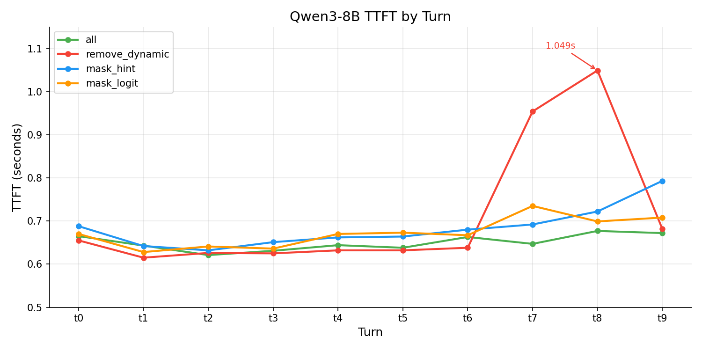

# 实验二：工具遮蔽

实验一测试了 logits masking 在约束输出格式上的效果。这个实验换一个场景：工具选择。

Manus 在 **Context Engineering for AI Agents** 中提出了"遮蔽，而非移除"（Mask, Don't Remove）：**当 agent 有大量工具时，不要按轮次动态删减工具列表，因为每次变动都会打断 KV cache 前缀，增加延迟和成本。应该保持完整工具列表不变，用 logits masking 阻止不可用工具的生成**。

这个建议听起来合理，我们用一组多轮工具调用任务来验证它。

## 实验设计

构建了 60 个工具，分为 12 组，每组 5 个，按照Manus所说，使用统一前缀命名（math\_\*、text\_\*、unit\_\*、code\_\* 等），方便批量遮蔽。其中 4 组是活跃工具（每轮任务只使用一组），8 组是填充工具。

15 个多轮对话任务，长度从 3 轮到 10 轮，每轮切换到不同的工具组。任务要求模型在每轮调用正确的工具并传入正确的参数。

四种工具管理策略：

| 策略 | 做法 | 工具列表变化？ | Prefix 稳定？ |
|------|------|-------------|-------------|
| `all` | 全部 60 个工具，不删除，无限制 | 否 | 是（基线） |
| `remove_dynamic` | 每轮对话前，仅展示当轮 5 个工具，其他动态删除 | 是 | 否 |
| `mask_hint` | 60 个工具 + 在用户消息前注入可用工具名 | 否 | 是 |
| `mask_logit` | 60 个工具 + 对不可用组的前缀设置 logit bias = -100 | 否 | 是 |

`mask_hint` 在每轮用户消息前加一行提示：`[Available tools this turn: math_add, math_gcd, ...]`，工具定义本身完全不变。实现上只需在转发请求时拼接一行文本，不涉及工具注册表的修改。

**`mask_logit` 的实现稍复杂**：先通过 vLLM 的 `/tokenize` 端点获取每个工具组前缀（如 `math_`、`text_`）对应的 token ID，然后对不可用组的前缀 token 设置 `logit_bias = -100`，在解码时直接将这些 token 的概率置零。模型在生成工具调用时物理上无法输出被封锁组的名称。**详细可以参考011实验的代码**。

模型：Qwen3-8B 和 Qwen3-14B，vLLM 推理，温度 0.0。每策略总共 93 轮对话，使用和实验一相同的推理框架与AWS实例。

## 缓存命中率：Manus 假设成立

TTFT（Time To First Token）= 模型开始生成后，到“第一个 token 被输出”的时间。

核心结果：

**Qwen3-8B：**

| 策略 | 准确率 | TTFT 均值 | 缓存命中率 | 平均输入 tokens |
|------|--------|----------|-----------|----------------|
| `all` | 98.1% | 0.645s | **99.8%** | 4,882 |
| `remove_dynamic` | 98.9% | 0.668s | **75.1%** | 879 |
| `mask_hint` | 98.9% | 0.667s | **98.9%** | 4,917 |
| `mask_logit` | 98.9% | 0.660s | **98.8%** | 4,818 |

**Qwen3-14B：**

| 策略 | 准确率 | TTFT 均值 | 缓存命中率 |
|------|--------|----------|-----------|
| `all` | 97.2% | 0.805s | **97.2%** |
| `remove_dynamic` | 98.9% | 0.754s | **71.0%** |
| `mask_hint` | 98.9% | 0.798s | **96.8%** |
| `mask_logit` | 97.2% | 0.752s | **98.2%** |

规律很清楚：保持工具列表不变的策略（`all`、`mask_hint`、`mask_logit`），缓存命中率都在 97% 以上。`remove_dynamic` 每轮更换工具列表，缓存命中率降到 71-75%，损失约 25 个百分点。

`remove_dynamic` 虽然每轮只传 5 个工具（~879 tokens），远少于其他策略（~4,900 tokens），但失去缓存复用的代价远大于减少 tokens 的节省。Manus 的观点在缓存行为上得到了验证。

TTFT 逐轮数据也印证了这一点：



`all` 的 TTFT 全程稳定在 ~0.65s，因为 60 个工具的大 prefix 在第一轮之后被完整缓存。`remove_dynamic` 在 t7 跳到 0.954s、t8 跳到 1.049s——这是 10 轮任务的末尾，每轮重建工具 prefix 加上累积的历史消息，计算量线性增长。

需要注意的是，后半段轮次（t7-t9）的数据点很少（仅 3-5 个），t7 和 t8 的尖峰各由一个离群值（2.26s 和 2.30s）主导。逐轮 TTFT 趋势的统计意义有限，**缓存命中率（75% vs 99%）是更可靠的衡量指标**。

## 准确率：60 个工具不构成挑战

**所有策略的准确率都在 97-99%，差距不超过 2pp**。15 个任务中只有 1 个（`chain_M_T_U_C_M_T`，6 轮）在所有策略、所有模型上均失败（83%），说明失败来自任务本身的歧义而非工具策略。其余差异是个别任务上的零星错误：8B 的 `all` 在一个 9 轮任务上失败，14B 的 `mask_logit` 在一个 4 轮任务上失败（后面会分析原因）。

**60 个工具对 8B 和 14B 都不构成选择困难，限制工具集带来的准确率提升不超过 1pp**。

## mask_logit 的副作用

从准确率和缓存看，`mask_logit` 的数据不错（98.8-98.9% 缓存命中，8B 上 98.9% 准确率）。但它有一个隐藏问题：**思维链溢出**。

从 observer 记录的完整上下文数据中统计了所有 `<think>` 未正常关闭（模型在思考中耗尽 max_tokens）的次数：

| 策略 | 8B 溢出次数 | 14B 溢出次数 |
|------|-----------|-----------|
| `mask_logit` | **7**（5个任务） | **1** |
| `all` | 5（3个任务） | 0 |
| `mask_hint` | **0** | **0** |
| `remove_dynamic` | **0** | **0** |

`mask_hint` 和 `mask_logit` 都有 60 个工具在上下文中，唯一区别是 logit bias。`mask_hint` 从未出现思维链溢出，`mask_logit` 出现了 8 次。

14B 上的具体失败案例（`chain_M_U_T_C` 第 4 轮，code\_ 组）可以从 observer 数据中看到完整过程：模型在 `<think>` 中正确识别了目标工具 `code_base64`，推理逻辑没有问题。但随后模型开始在思维链内部"预演"工具调用的 JSON 结构，进入了递归嵌套：

```
So the tool call should be:
{"name": "code_base64", "arguments": {"name": "code_base64", "arguments": {"name": "code_base64", ...
```

这个循环持续到 max_tokens，`</think>` 始终没有生成，工具调用也没有发出。同一个任务在 `mask_hint` 策略下正常完成，思维链干净利落。

8B 上的溢出模式略有不同——多数是模型在思维链中反复审视工具参数定义，陷入过度推理而非递归 JSON。但共同点是：**Logit bias 改变了 token 概率分布，使模型更容易在 `<think>` 中进入退化生成模式**。

这和实验一的发现一致：logits masking 对模型输出的干预不区分"最终输出"和"中间推理"。在约束解码中，它阻断了 `<think>` token；在工具遮蔽中，它扰乱了思维链的正常结束。机制不同，但本质相同。

## mask_hint：最优策略

| 指标 | `mask_hint` vs `remove_dynamic` | `mask_hint` vs `mask_logit` |
|------|-------------------------------|---------------------------|
| 准确率 | 持平（98.9%） | 8B 持平，14B 高 1.7pp |
| 缓存命中率 | 高 ~25pp | 持平 |
| 副作用 | 无 vs 长对话 TTFT 尖峰 | 无 vs 思维链干扰 |

`mask_hint` 不修改工具列表（保住缓存），不修改 logits（不干扰推理），只在用户消息前加一句提示。它的准确率和 `remove_dynamic` 一样高（98.9%），缓存命中率和 `all` 一样好（~97-99%），在两个模型上都没有副作用。

从工程角度看，这也是最自然的方案：路由层在转发请求时附加上下文，工具注册表不需要变动，与工具调用的架构完全兼容。

## 总结

Manus 的"**遮蔽，而非移除**"假设在缓存行为上得到了验证：动态移除工具使缓存命中率损失 25 个百分点。但 Manus 推荐的 logit masking 不是最优解，它会干扰模型的思维链。

更简单有效的做法是 `mask_hint`：**保持工具列表完整，通过 prompt 告诉模型当前可用哪些工具**。不改 logits以及工具列表。
